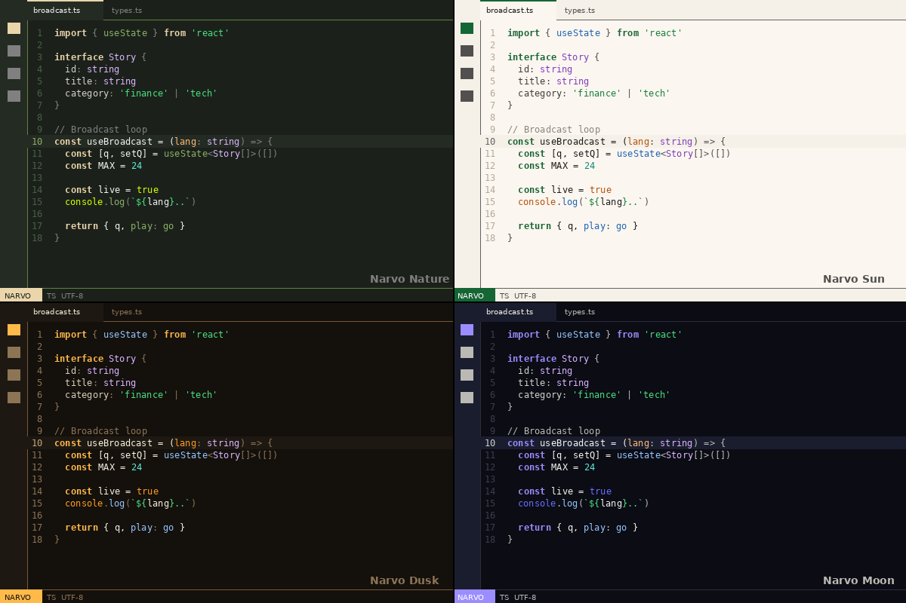

# Narvo News Theme for VS Code

A Swiss-brutalist VS Code theme derived from the **[Narvo News](https://github.com/ajibolagenius/narvo_news)** design system — Africa's audio-first news platform. Four distinctive palettes built on sharp edges, mono-UI typography, and an 8pt spacing grid.



---

## Variants

**Narvo Nature** — Deep matte forest (`#1B211A`) with sand/beige accents (`#EBD5AB`) and sage green syntax. The default Narvo experience.

**Narvo Sun** — Warm parchment (`#FCF6F0`) with deep green accents (`#166534`). Clean, readable, and distinctly editorial.

**Narvo Dusk** — Near-black warmth (`#14100C`) with amber accents (`#FFBA4A`) and rich amber borders (`#785834`). The firelight theme.

**Narvo Moon** — Deep navy void (`#0B0C14`) with soft purple accents (`#9B8DFF`). Electric and Vite-inspired.

---

## Design System

Every color is pulled directly from the Narvo News CSS custom properties (`--color-bg`, `--color-surface`, `--color-border`, `--color-primary`, etc.) across all four `[data-theme]` definitions.

| Role | Nature | Sun | Dusk | Moon |
|------|--------|-----|------|------|
| **Background** | `#1B211A` | `#FCF6F0` | `#14100C` | `#0B0C14` |
| **Surface** | `#242B23` | `#F5F0E8` | `#1E1812` | `#1A1D2E` |
| **Border** | `#628141` | `#646260` | `#785834` | `#2A2D3A` |
| **Accent** | `#EBD5AB` Sand | `#166534` Green | `#FFBA4A` Amber | `#9B8DFF` Purple |
| **Keywords** | `#EBD5AB` | `#166534` | `#FFBA4A` | `#9B8DFF` |
| **Functions** | `#8BAE66` | `#1E64B4` | `#93C5FD` | `#93C5FD` |
| **Strings** | `#4ADE80` | `#15803D` | `#4ADE80` | `#4ADE80` |
| **Types** | `#D8B4FE` | `#7E3EBE` | `#D8B4FE` | `#D8B4FE` |
| **Numbers** | `#5EEAD4` | `#0D8A78` | `#5EEAD4` | `#5EEAD4` |
| **Constants** | `#D4FF00` | `#B45309` | `#FF9A20` | `#646CFF` |
| **Params** | `#FDBA74` | `#B45309` | `#FF9A20` | `#FDBA74` |
| **Comments** | `#808080` | `#8A857C` | `#8C7454` | `#BAB9B4` |

The Narvo Design System's **semantic category colors** (finance, tech, urgent, politics, science, culture, sports, health, security, environ) are woven into bracket colorization and terminal ANSI colors for a uniquely editorial feel.

---

## Design Philosophy

Narvo follows **Swiss design principles**: sharp edges (`border-radius: 0`), mono-UI typography via `JetBrains Mono` and `Space Grotesk`, 8pt spacing grid, and deliberate structural borders. This translates to crisp tab borders, decisive accent colors, and zero-radius visual language throughout the VS Code workbench.

The four themes map to times of day: Nature for the earthy default, Sun for daylight reading, Dusk for warm evening sessions, and Moon for deep night work.

---

## Language Support

Comprehensive syntax highlighting for JavaScript/TypeScript (template literals, JSX components, generics), Python (decorators, self/cls, magic methods), Rust (lifetimes, macros), HTML/CSS (tags, properties, pseudo-classes, units), JSON, and Markdown. Semantic token colorization is enabled for supported languages.

---

## Installation

### From the Marketplace
1. Open **Extensions** (`Ctrl+Shift+X` / `Cmd+Shift+X`)
2. Search for **Narvo News Theme**
3. Click **Install**
4. `Ctrl+Shift+P` → **Preferences: Color Theme** → select **Narvo Nature**, **Narvo Sun**, **Narvo Dusk**, or **Narvo Moon**

### From VSIX
```bash
code --install-extension narvo-news-theme-1.1.0.vsix
```

Or in VS Code: Extensions sidebar → `⋯` menu → **Install from VSIX...**

---

## Recommended Settings

Match the Narvo stack:

```json
{
  "editor.fontFamily": "'JetBrains Mono', 'Fira Code', monospace",
  "editor.fontLigatures": true,
  "editor.fontSize": 13,
  "editor.lineHeight": 1.6,
  "editor.letterSpacing": 0.3,
  "editor.cursorBlinking": "smooth",
  "editor.cursorSmoothCaretAnimation": "on",
  "editor.bracketPairColorization.enabled": true,
  "editor.renderLineHighlight": "gutter",
  "workbench.colorTheme": "Narvo Nature"
}
```

---

## Customization

Override any color in your `settings.json`:

```json
{
  "workbench.colorCustomizations": {
    "[Narvo Dusk]": {
      "editor.background": "#120E0A"
    }
  },
  "editor.tokenColorCustomizations": {
    "[Narvo Nature]": {
      "comments": "#6B6B6B"
    }
  }
}
```

---

## Contributing

1. Fork and clone the repo
2. Edit the theme JSON files in `themes/`
3. Press `F5` in VS Code to launch the Extension Development Host
4. Test your changes and submit a PR

---

## License

[MIT](LICENSE) — Copyright (c) 2026 AJIBOLA DON_GENIUS

<p align="center">
  <em>Built for <a href="https://github.com/ajibolagenius/narvo_news">Narvo News</a> — The Local Pulse, Refined.</em>
</p>
